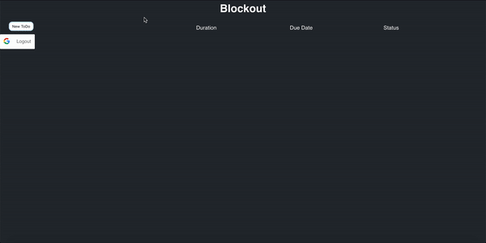

# Blockout

# What is Blockout?

Blockout is an application that will interact with google calendar to "block out" times for you to do work. For example, if you want to spend 5 hours a week studying for an exam, blockout will find available times throughout the week and create Gcal events for them. Ideally, the user will have lots of options and customization for how times are blocked out.

Blockout is currently still under development.

# Current Demo/example

## Motivation

As someone who uses google calendar religiously, I realized that I work best when I see I have tasks listed on my calendar. This works great for classes and events, but for assignments or project assignments, I often have trouble setting aside time to work on them until the very last minute. To solve this, I have tried manually inputting blocks of time throughout the week where I can work on these assignments, and after doing this, have realized that all of this could be automated with a single application.

## Objective

The purpose of this application is to connect with a user's google calendar and input events based on certain criteria defined by the user. For example, if the user wants to spend an hour a day exercising, the application will try to find time in the user's calendar to do this. In another example, if the user has a project that requires 10 hours of work to be done, and they want to work 2 hours each day, the application will find 2 free hours each day where the user should work on their project.

## Existing Features

- Users can login to Blockout using their google account
- Events added in Blockout will be added to a user's google calendar
- List of todos are saved and can be viewed on the Blockout [frontend](https://github.com/16lim21/Blockout-web/)
- Todos can be deleted from Blockout and will be removed from a user's calendar

## Key Features to implement

- Edit and modify a specific todo in blockout
- Implement core functionality of blockout (blocks out time for a user to work on a todo)
- Rearrange events in google calendar without needing to do so in the application (and have the application remember it).
- The ability to postpone or complete an event in google calendar without having to navigate to the application website.

## Developer Documentation
Check out our [Contributing Documentation](CONTRIBUTING.md) and [Code of Conduct](CODE_OF_CONDUCT.md)

